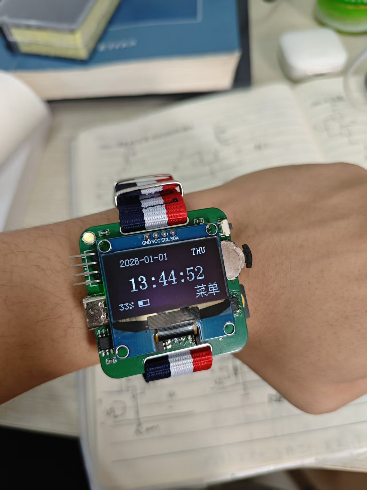
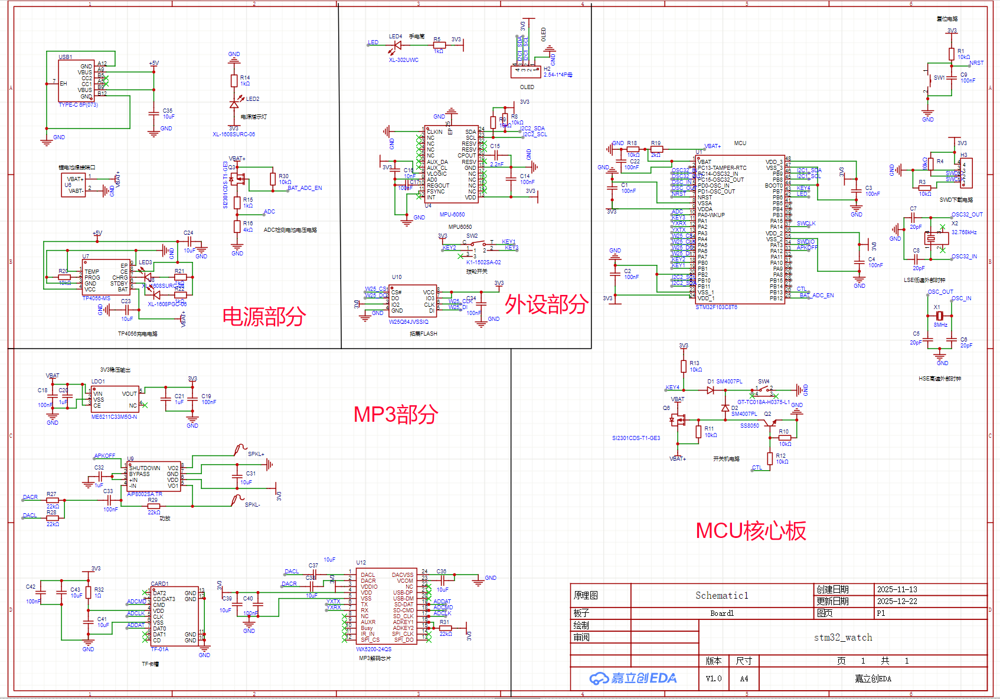
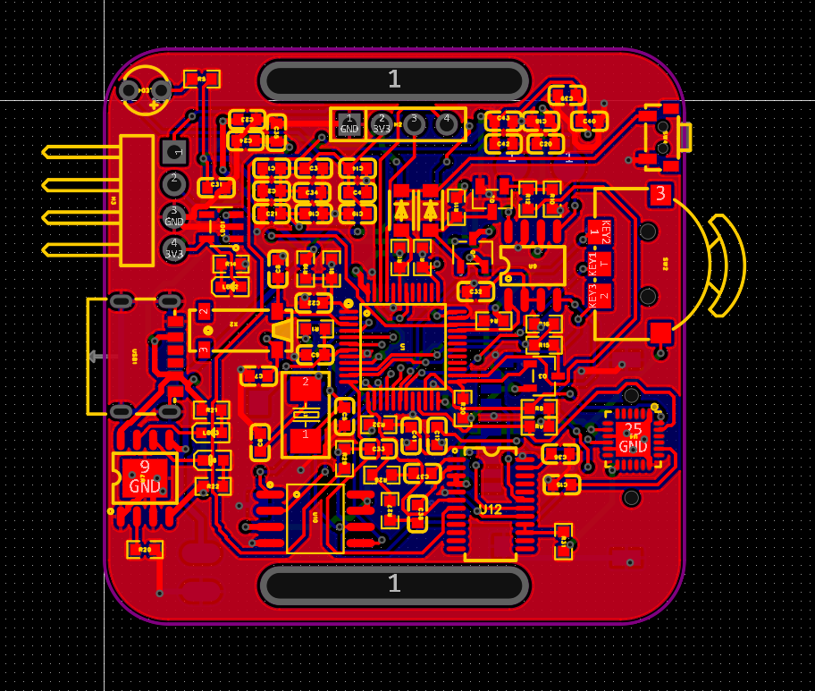
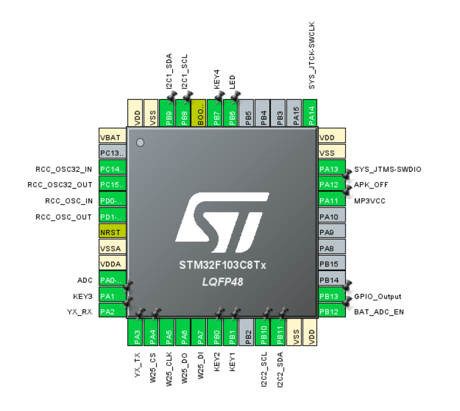

# STM32智能手表

*做这个表本意是想学习FreeRTOS的，当我按照非阻塞式构建完工程框架后发现要转FreeRTOS情况比我想象的困难的多，我已经不想再折腾了，所以FreeRTOS有缘再见吧*

## 1. 功能展示

开机原神动画

时间日期设定，关机不丢失（包括一些设置的数据）、无操作休眠，抬腕亮屏

屏幕亮度调节、音乐播放、水平仪、手电筒、闹钟、信息展示，游戏（谷歌小恐龙，

俄罗斯方块）等



## 2. 工程架构

按照module -> middleware -> application的结构

我把工程分为四份

```txt
watch_project---|----Core(cubemx生成的底层配置代码)
				|
				|----module|--battery.c/h
				|		   |--font.c/h
				|          |--key.c/h
				|          |--mp3_player.c/h
				|          |--mpu6050.c/h
				|          |--oled.c/h
				|		   |--w25qxx.c/h
				|          |--yx5200_hal.c/h
				|
				|----middlewares|--app_power.c/h
				|               |--clock.c/h
				|               |--menu_core.c/h
				|               |--menu_data.c
				|               |--mp3_test.c/h
				|               |--sys_params.c/h
				|              
				|----applications|--app_about.c/h
				|                |--app_dino.c/h
				|                |--app_flashlight.c/h
				|                |--app_gradienter.c/h
                |                |--app_message.c/h
				|                |--app_mp3.c/h
				|                |--app_setting.c/h
				|                |--app_timer.c/h
				|                |--app_game.c/h
                
    scripts-----|----------------|--字库烧录|--font_generater.py
                |                |         |--字库数据.h/c
                |----------------|--music_converter
  
				
```

## 3. 模块功能

### （1）module层

这主要是各个外设的驱动，部分来自开源，我进行适应性修改；电压测定来自于b站up主火禾实验室，oled.c/h、font.c/h 来自波特律动开源，mpu6050来自于b站up主高过_，很漂亮卡尔曼滤波算法，优雅而强大

bettery.c/h中我们通过ADC采样，获得间接获得电池电压的的数字量，并转换成百分比，在接线图中，PA0为ADC采样引脚Mode: IN0， Sample time: 239.5Cycles

由于4k欧电阻不是很常见，且用量较少，我们改变了火禾开源中这个电阻为2k,按照火禾开源的接线计算：空电时：ADC测量的电压范围在 3.3*0.8 = 2.64到4.1 * 0.8 = 3.3；2.64对应的AD值为2.64/3.3 * 4095 = 3276，但是按照我们的计算，我们测得的电压范围只能时4.1*0.67 = 2.747v, 3.3 *  0.67 =2.211

充满电后，实测ADC值为2500+-10， 那么根据 $V{空} / V{满}$ = 0.8，那么空电的ADC应该为2000，

相较于波特律动的开源0.96寸屏幕驱动，我们对1.3寸oled屏幕做了适配，并在font.c/h加入了各个图标和原神开机所用动画，oled.c/h文件中加入了亮度调整，设置开机初始化亮度，显示烧录在字库中的中文字符等

f103c8t6芯片本身不直接参与音乐解码，读取sd卡和mp3解码的任务由YX5200- 24ss/qs实现（ss太难买了，一片要几乎10块钱，qs的各个引脚与ss完全相同，只是封装略小，这一点要注意，第一版踩的坑，后来了解到，其实也可以用杰里的mp3解码芯片实现，更强大也更便宜），mcu通过串口发送指令给解码芯片处理，这也是yx5200_hal.c/h的主要功能

w25qxx用来给flash烧录中文字库，我们通过stlink烧录，而mcu内的rom只有64k所以要分好多次烧录，其实可以引出一个串口接口，用串口一次性烧录完成


### （2）middleware层

app_power用于管理休眠和唤醒

clock.c/h则调用rtc功能，读取年月日，时分秒，值得一提的是，我们的mcu的VBAT引脚直接接在了电池的VBAT+上，这使得关机后，时间不会丢失

menu_core.c/h作为菜单驱动引擎，是整个手表的灵魂，

它不包含具体的菜单内容，只负责**“怎么显示”**和**“怎么交互”**

- **状态机管理**: 维护系统当前的运行模式：
  - SYS_MODE_MENU: 正在浏览层级菜单
  - SYS_MODE_APP: 正在运行独立应用程序（如游戏、电子书、MPU数据显示）
  - SYS_MODE_POWER_POPUP: 全局覆盖层（如关机确认弹窗）
- **渲染引擎**: 提供两套标准的 UI 布局渲染逻辑：
  - **列表模式 **: 适用于设置页、工具箱，支持超长列表滚动、动态标题栏隐藏/显示
  - **轮播模式 : 适用于主菜单，支持图标居中放大、左右预览的 Cover Flow 效果
- **性能优化**:
  - **按需刷新 **: 引入 needs_update 标志位，静止状态下停止 I2C 传输，消除屏幕闪烁并降低功耗。
  - **光标记忆**: 实现了 Menu_NavigateBack 逻辑，从子菜单返回时能自动定位到之前选中的父菜单项。


menu_data 是 UI 的数据库，通过结构体数组静态定义了菜单树。添加新功能时，通常只需在此处注册，无需修改核心逻辑。

- **MenuItem (菜单项)**: 定义了每一项的属性：
  - name: 显示的文本（支持中英文）。
  - icon: 关联的图标数据（仅轮播模式需要）。
  - next_page: 指向子菜单的指针（用于层级跳转）。
  - run_app: 指向应用程序入口函数的指针（用于启动 App）。
- **MenuPage (页面)**: 定义了一个页面的属性：
  - parent: 指向父级菜单（用于返回）
  - layout: 指定该页面是列表还是轮播布局
- **扩展性**: 新增一个 App 只需编写 App 逻辑，然后在 menu_data 的数组中添加一行 { "Name", &Icon, NULL, App_Func_Name } 即可


有了这套引擎，我们要加入一个新功能时，就不用专门另写一套逻辑，而是把个参数填入准备好的函数模块中即可


sys_params 负责系统配置的持久化存储，确保掉电后配置不丢失。它充当了应用层与底层存储（W25Q128）之间的中间件。

- **存储机制**:

  - 使用外部 Flash (W25Q128) 的 **最后一个 4KB 扇区** (0x00FFF000) 存储配置结构体。
  - **安全性**: 引入 Magic Number (魔术字) 和 Checksum (校验和) 机制。开机时自动校验，若数据损坏或检测到新固件，自动恢复默认值。

- **所见即所得 **:

  - 提供了 System_Params_Save() 接口，在用户修改配置并确认时，自动执行“擦除扇区 -> 写入数据 -> 重新应用硬件设置”的原子操作。

- **管理参数**:

  - **亮度**: 配合 oled.c 的强制刷新接口，解决开机亮度突变问题。
  - **静音**: 控制 MP3 模块的功放物理锁。
  - **休眠**: 动态调整系统自动息屏的超时时间。
  - **闹钟**: 记忆闹钟的时间与开关状态。

  ---

  **如何添加一个新功能？**

得益于模块化的设计，添加新功能非常简单：

1. 编写业务逻辑: 在 Core/Src 下新建 app_myfeature.c，实现按键处理和屏幕绘制。
2. 注册菜单: 在 menu_data.c 的目标菜单数组中添加一项，指向入口函数。
3. 编译烧录: 系统会自动处理菜单导航、返回逻辑和内存管理。

---

### （3）applications层

*这里的水平仪和谷歌小恐龙均移植自火禾开源*

app_about.c/h是一个的图片浏览器，主要用于展示存储在外部 Flash 中的个人名片或二维码。它跳过了单片机内部存储限制，通过直接读取 W25Q128 的特定扇区数据来渲染大尺寸图片，并支持通过按键在不同图片之间循环切换。

app_dino.c/h实现了经典恐龙快跑游戏。内部实现了基于 HAL_GetTick 的物理跳跃引擎和障碍物生成算法，利用直接操作显存（GRAM）的方式实现了流畅的背景滚动效果，具备精准的 AABB 碰撞检测与分数统计功能。

app_flashlight.c/h实用的应急照明工具。通过向 OLED 显存填充全白数据并强制提升屏幕对比度指令，将屏幕瞬间变为高亮白光手电筒。该模块逻辑独立，支持在任何状态下快速开启或关闭，体现了极简工具的设计理念。

app_gradienter.c/h基于 MPU6050 传感器的六轴电子水平仪。它实时采集传感器的 Roll（横滚）和 Pitch（俯仰）角数据，经过卡尔曼滤波处理后，将物理倾斜角度映射为屏幕上的气泡坐标，提供直观的平面水平检测功能。

app_message.c/h支持 GBK 中文的长文本阅读器，目前作为“电子说明书”使用。它实现了从外部 Flash 定址读取文本数据的逻辑，支持超长文本的逐行平滑滚动显示和右侧进度条指示，有效解决了 MCU 内部 Flash 存不下长文档的问题。

app_mp3.c/h是YX5200 语音模块的图形化控制前端。它封装了播放、暂停、切歌、音量调节等 UART 指令，并与系统底层的“静音锁”逻辑挂钩，在界面上直观反馈当前的播放状态和音量等级，实现了软硬件状态的同步。

app_setting.c/h系统的中央控制台。提供可视化的列表界面来修改系统参数，包括屏幕亮度（带实时预览）、自动休眠时间、系统日期时间以及静音开关。所有修改在退出时会自动通过 sys_params 模块触发 Flash 写入，确保持久化保存。

app_timer.c/h包含秒表和闹钟的时间工具集。秒表支持毫秒级计时；闹钟设置界面允许用户设定触发时间与开关，当后台 RTC 时间匹配时，会强制中断当前任务跳转至响铃界面，并联动 MP3 模块播放闹钟铃声。

app_game.c/h 完整的俄罗斯方块游戏逻辑实现。包含 7 种标准方块的生成、旋转算法、踢墙检测以及行消除逻辑。设计了横屏难度选择与竖屏游戏操作的切换逻辑，并集成了游戏结束后的自动重置与分数结算功能。

## 4.  Scripts

下载到sd卡的音乐需要经过mp3.py的处理，统一转化成128k码率，44100HZ的mp3格式，并重命名为001、002…. 防止有些文件无法被YX5200解码导致播放失败，注意改里边的文件存放路径

font_generater.py则按照GB2312编码生成汉字字库，从而使oled.c中的OLED_ShowGBK（）函数实现对汉字时间复杂度为O(1)的查找；但是按字号12，16，24生成的字库实在使太大了，烧录起来很麻烦，为此

```python
# 生成的字号列表
FONT_SIZES = [16]
```

只有16号，后续可以自己添加

那些.h文件就是16号汉字取模数组，py在生成这些文件可能加了看不见的空格，导致每页（.h）结束文件的索引都会加10，比如计算后的索引为0x65,这个汉字在第2页，则需要对计算结果加10处理，如果在第3页则要加20（已经在OLED_ShowGBK（）改过了）

烧录时，应先在main.c中加入

```c
#include "burn_data.h"
#include "font_write.h"
...
int main()
{
    ....
    //init不要动
    /* USER CODE BEGIN2 */
    write_process ();
	/* USER CODE END2 */
    //while（1）里边全部注释

}
```

跟着oled屏幕只是操作，记得每次烧录完后在burn_data.h中改`#define BURN_STEP `


## 5. 硬件部分

硬件部分主要借鉴了火禾实验室和立创开源平台lune233大佬的开源

[STM32手表教程（全网最详细!)_哔哩哔哩_bilibili](https://www.bilibili.com/video/BV1CoGuzEEeN/?spm_id_from=333.1387.homepage.video_card.click)

[stm32手表 - 立创开源硬件平台 (oshwhub.com)](https://oshwhub.com/lune233/huanghuai-campus-pcb)







我扩大了火禾画的板子尺寸，并保留形状，借鉴了lune233的mp3电路并删去了mp3开关，对layout重新布局优化，把mpu6050放在板子外侧，便于处理加热台没有焊好的mpu6050的引脚

其中，开关机电路的逻辑是按住K4会导致PMOS的栅极变成低电平，PMOS管导通VBAT+等于BAT, 单片机在这一瞬间通电开始工作，拉高ctl引脚使这个npn型三极管导通这时PMOS管的栅极电压等于GND电压，从而维持于低电平，因此即使我们松开按键这个PMOS也是导通的，实现开机;
当关机时，我们让单片机拉低ctl引脚, 三极管截止，此时PMOS的栅极电压恢复高电平，VBAT+与VBAT断开，单片机断电，实现关机

因此焊好板子没烧录程序时后按下key4可以看到电源灯指示亮起，松开后熄灭是正常现象（没有拉高ctl引脚），不必惊慌（这么说是因为我惊慌过，还以为电路又画错了。。。）

由于我删去了mp3的物理开关，因此我们没办法直接断掉功放的电源，所以只能通过软件拉高功放的shutdown引脚实现功放关闭的状态，这也是美中不足的一点，可能会导致额外的耗电


## 6. 写在最后

这个项目从软件的模块化编程，“高内聚，低耦合”，到硬件的电路知识，对我来说是一次很大的考验，第一次因为擅自修改drc布线规则导致板子全部短路，第二次没有灵活转化电路导致mpu和yx5200链接不上，第三次才尝试成功，

在整个过程中，这个学期学的数电模电知识得到了深刻体现，这次经历或许也能成为正在进行期末复习的我面对青面獠牙，一头雾水的数模电题目无所适从时，一点微不足道但坚如磐石的信念。。。


---

*备注：用于处理音频的ffmpeg等文件太大了,git 提交不上去，我将把它们移除，需要时可以去官网下载，下面给出操作*

FFmpeg 有编译并分发无恶意、适配 Windows的exe文件

1. 打开 FFmpeg 官方推荐的第三方下载页：

   ✅ 首选：

   Gyan.dev FFmpeg Builds

   （稳定、更新快，适配 Windows 64 位）

   ✅ 备选：

   BtbN FFmpeg Builds

   （GitHub 开源编译版）

2. 下载适配版本：

   Gyan.dev：找到 `ffmpeg-release-full.7z`（完整版，包含 `ffmpeg.exe`/`ffplay.exe`/`ffprobe.exe`），点击下载；

3. 解压文件：

   **用 7-Zip/WinRAR 解压下载的压缩包，进入解压后的 `bin` 目录，即可看到这三个 exe 文件**；

   

4. 复制到项目目录：

   将这三个 exe 复制到你项目的 `scripts/music_converter/` 目录下（
